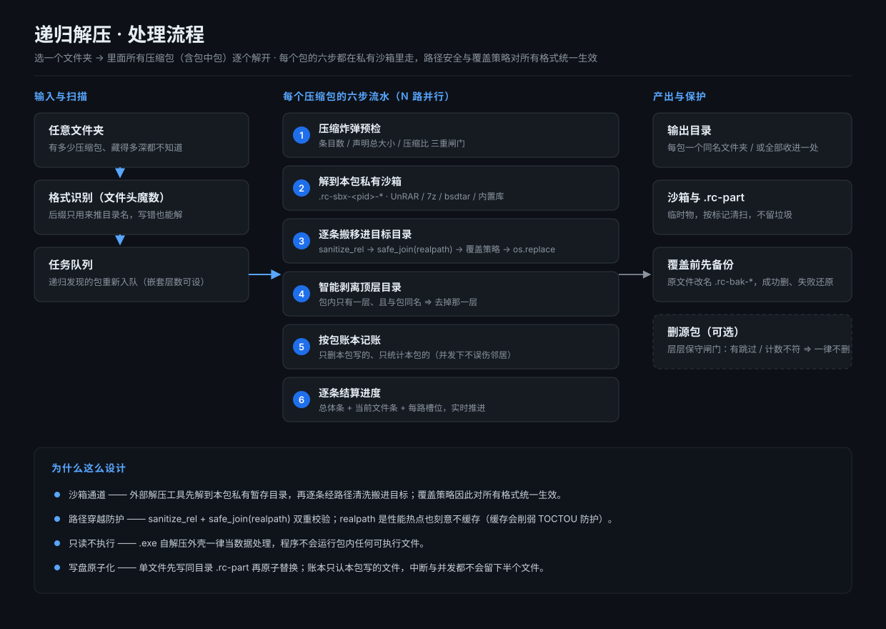
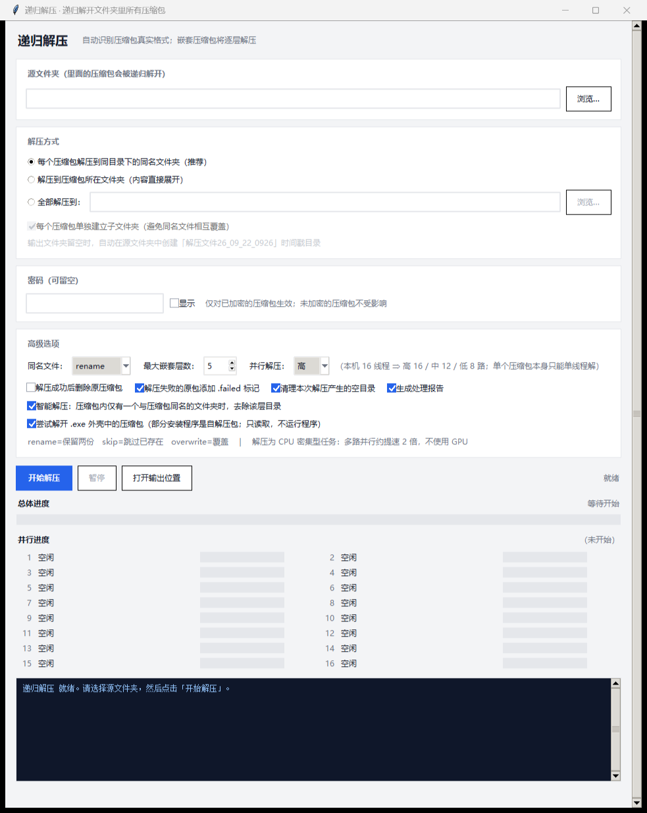

# 递归解压 · RecursiveExtract

> 本工具由 DeepSeek（DSH agent）编写，由 CNyaotian 维护与发布。

选一个文件夹，把里面**所有**压缩包递归解开 —— 压缩包里面还有压缩包，也照样一层层解开。
Windows 桌面程序，单文件、免安装，不需要 Python / 7-Zip / WinRAR。





## 下载

从 [Releases](../../releases) 下载 `RecursiveExtract-v1.5.7-win64.exe`，放到任意目录双击即可运行。
（exe 是单文件的，整个文件夹挪走也能用。）

## 它解决什么问题

- **后缀名不准也没关系**：按文件头魔数识别真实格式，`xxx.7z` 其实是 tar、没有后缀、后缀写反 —— 都照解。
- **递归**：解开来的压缩包如果还是压缩包，继续解，直到没有为止（最大嵌套层数可设）。
- **中文名不乱码**：老式 Windows 压缩包（GBK 编码的文件名）也能正确还原。
- **加密包只问一次密码**：密码填一次，**只对需要密码的包生效** —— 没密码的包照常解。
  密码填错不留半成品（整包回滚，原文件一个字不动）。
- **并行解压**：按 CPU 逻辑线程数自动分档（高 / 中 / 低），也可以手动指定路数。
- **暂停 / 继续 / 停止**：暂停是在文件边界生效的（可继续）；停止是强制终止 + 清理临时文件，
  已经解出来的内容**保留**。
- **覆盖策略可选**：`rename`（保留两份）/ `skip`（跳过已存在）/ `overwrite`（覆盖），
  覆盖前会把你的原文件改名成 `.rc-bak-*`，成功后才删、失败自动还原。

## 支持的格式

| 格式 | 通路 |
|---|---|
| zip / 7z / tar / tar.gz / tgz / tar.bz2 / tar.xz / gz / bz2 / xz / zst / iso / cab | 内置 Python 库 + Windows 自带 `tar.exe` |
| **rar（含加密 rar4 / rar5、文件名加密）** | 内置 RARLAB 官方 `UnRAR.exe` |
| `.exe` 自解压外壳（RAR / 7z / ZIP 壳） | 只当数据读取，**绝不执行该 exe** |

## 从源码运行

需要 Python 3.12：

```bat
pip install py7zr pyzipper pyzstd
python src\app.py
```

> `py7zr` / `pyzipper` 是解 7z 与 AES 加密 zip 的运行依赖；`pyzstd`（或 `zstandard`）用于
> zstd 格式（`.zst`）—— 没装它时解这类文件会报「缺少 zstd 解压库」。

## 自测

```bat
python src\selftest_core.py
```

覆盖格式识别、路径安全、覆盖策略、炸弹防护、并行档位换算等共 **97 项**（当前全绿）。

## 打包成单文件 exe

```bat
pyinstaller --noconfirm --clean --onefile --name RecursiveExtract ^
  --icon src\app.ico ^
  --add-binary "src\bin\UnRAR.exe;bin" ^
  --add-data "src\bin\UnRAR-license.txt;bin" ^
  src\app.py
```

## 安全设计

- **沙箱通道**：所有外部解压工具先解到本包私有的暂存目录（`.rc-sbx-*`），再逐个经
  路径清洗 + `realpath` 校验后搬进目标目录 ⇒ 覆盖策略对所有格式统一生效，
  外部工具也写不穿目录联接点，取消与压缩炸弹都有响应点。
- **路径穿越防护**：包内条目经 `sanitize_rel` + `safe_join(realpath)` 双重校验，
  拒绝 `../` 之类的越界条目。
- **压缩炸弹防护**：按条目数、声明总大小、压缩比三重闸门预检；运行期另有比例闸。
- **只读不执行**：`.exe` / SFX 外壳一律当数据处理，程序不会运行包内任何可执行文件。
- **密码不落盘**：密码不进日志、不进处理报告、不写进配置文件。
- **写盘原子化**：单文件先写同目录 `.rc-part` 再原子替换，中断不会留下半个文件。

## 第三方组件

- **UnRAR.exe** —— 版权归 RARLAB，随包附 `src/bin/UnRAR-license.txt`。
  本程序只用它**解压** RAR 归档，不涉及 RAR 压缩算法的实现。
- **py7zr** / **pyzipper** / **pyzstd** —— 运行依赖，分别在各自许可证下分发。

## 已知限制

- 7z 包内若含特别大的单个文件，暂停需要等该文件解完（格式限制，无法中途掐断）。
- `iso` / `cab` 等格式拿不到单文件粒度进度，界面会退回显示"本包进度"。
- 解压本身是 CPU 密集型任务，**不使用 GPU**；多路并行实测约提速 2 倍。

## 运行环境 / Requirements

- **Windows + Python 3**（GUI 基于 tkinter；本机在 **Python 3.12** 上实测通过，自带自测 97/0）。
- **外部解压器**（按压缩包格式自动选择，缺失的格式会跳过并提示）：`7z`/`7za` 或 `py7zr`、`UnRAR.exe`（本仓自带，见 `src/bin/`）、`pyzstd` 或 `zstandard`（`.zst`）、`zlib`/`gzip`/`tar`（标准库）。
- **运行依赖**：`pip install py7zr pyzipper pyzstd`（仅在使用 7z/AES 加密/zstd 时需要）。
- **权限**：普通用户即可；只读写你选择的目录。
- ⚠️ `src/bin/UnRAR.exe` 是 RARLAB 官方工具，**不适用本仓的 MIT 许可**（条款见 `src/bin/UnRAR-license.txt`）。

**English:**
- **Windows + Python 3** (the GUI is tkinter-based; verified on **Python 3.12** here, with its bundled self-test at 97/0).
- **External extractors** (chosen automatically per archive format; missing ones are skipped with a message): `7z`/`7za` or `py7zr`, `UnRAR.exe` (bundled, see `src/bin/`), `pyzstd` or `zstandard` (`.zst`), and `zlib`/`gzip`/`tar` (standard library).
- **Runtime dependencies**: `pip install py7zr pyzipper pyzstd` (needed only for 7z / AES-encrypted / zstd archives).
- **Privileges**: an ordinary user is enough; it only reads and writes the directories you pick.
- ⚠️ `src/bin/UnRAR.exe` is an official RARLAB tool and is **not covered by this repo's MIT license** (terms in `src/bin/UnRAR-license.txt`).

## 权限与依赖 / Permissions & Dependencies

> 下面逐项列出本程序对系统的接触面，措辞取保守值：**"源码里未发现"不等于"绝不可能发生"**。
> Each item below lists a system surface this program touches; wording is deliberately conservative:
> **"not found in the source" does not mean "can never happen"**.

**文件 / Files**

- 读：你在界面上选的源文件夹（含子目录）；程序自身所在目录（用来定位 `bin\UnRAR.exe`、`bin\UnRAR-license.txt`）。
- 写：解压产物写进目标目录（默认是"每个压缩包旁边的同名文件夹"）；临时沙箱 `.rc-sbx-*` 与半成品
  `.rc-part` 建在**目标目录所在卷**上；设置写进 `%APPDATA%\RecursiveExtract\settings.json`
  （读 `APPDATA` 环境变量，取不到时回落到用户主目录）；勾了「生成处理报告」会在输出目录写
  `解压报告*.txt`；覆盖策略为 `overwrite` 时先在**同目录**留一份 `.rc-bak-*` 备份（成功后删除、失败还原）。
- 删：只有显式勾选「解压成功后删除原压缩包」/传 `--delete`，且该包**完全成功**时才删原包；
  `.exe` 外壳与 Office 类文档永不删；「清理空目录」只删本次解压自己建出来的空目录。
- 本程序会**打开资源管理器**（「打开输出位置」按钮，走 `os.startfile`）；不会运行压缩包里的任何程序。

- Reads: the source folder you pick (including subfolders) and its own installation folder (to locate
  `bin\UnRAR.exe` and `bin\UnRAR-license.txt`).
- Writes: extracted files go to the target folder (by default a same-named folder next to each archive);
  the temporary sandbox `.rc-sbx-*` and partial files `.rc-part` live on the same volume as the target;
  settings go to `%APPDATA%\RecursiveExtract\settings.json` (reads `APPDATA`, falls back to the user home
  directory); with "generate report" enabled it writes `解压报告*.txt` into the output folder; with the
  `overwrite` policy it first keeps a `.rc-bak-*` copy in the same directory (removed on success,
  restored on failure).
- Deletes: an original archive only when you explicitly enable "delete the original after a successful
  extraction" / `--delete` **and** that archive fully succeeded; `.exe` shells and Office-like documents
  are never deleted; "clean empty directories" only removes directories this run created.
- It opens **File Explorer** (the "open output location" button, via `os.startfile`) and never runs
  anything from inside an archive.

**网络 / Network**

- 源码里**未发现**任何网络访问代码：没有 HTTP 客户端、没有遥测、没有更新检查、没有 socket 调用；
  解压全部在本地完成，也不会让外部解压工具去联网。
- 保守提示：若系统上的 `tar.exe`（先按 `PATH` 命中）已被换成会联网的第三方程序，
  那部分行为不在本程序控制范围内。

- The source contains **no** network code: no HTTP client, no telemetry, no update check, no socket use;
  extraction is entirely local and it does not make the external tools go online either.
- Conservative note: if `tar.exe` on your system (resolved from `PATH` first) has been replaced by
  something that talks to the network, that behaviour is outside this program's control.

**命令 / Commands**

- 会启动的外部命令（只用于解压，且只在内置实现干不了时）：
  - `bin\UnRAR.exe`（随包附带，RARLAB 官方 freeware）：解 RAR / RAR5 / 加密 RAR / 自解压 `.exe` 外壳；
  - `tar.exe`：先找 `PATH` 里的 `tar`，找不到再回落到 `%SystemRoot%\System32\tar.exe`，
    用于 iso / cab / AES 加密 zip 等。
- 不需要管理员权限：不写系统目录、不装服务、不改注册表，也不申请 UAC 提权。
- 生命周期脚本：**无**。本仓没有 `preinstall` / `postinstall` 之类的安装钩子；
  从源码运行只需要上面那一条 `pip install`。

- External commands it starts (extraction only, and only when the built-in path cannot handle it):
  - `bin\UnRAR.exe` (bundled, RARLAB official freeware) for RAR / RAR5 / encrypted RAR and
    self-extracting `.exe` shells;
  - `tar.exe` — `tar` from `PATH` first, falling back to `%SystemRoot%\System32\tar.exe` — for
    iso / cab / WinZip-AES zips and similar.
- No administrator rights: it does not write to system folders, install services or modify the registry,
  and it never requests UAC elevation.
- Lifecycle scripts: **none**. This repository has no `preinstall` / `postinstall` hook; running from
  source needs only the single `pip install` command above.

**凭据 / Credentials**

- 没有账号、令牌或密钥；仓库里不含 `.env` 之类的凭据文件。
- 压缩包密码只存在于本次进程的内存与子进程命令行里：不写日志、不写处理报告、
  不写 `settings.json`（那里根本没有密码字段）。
- ⚠️ 已知限制：为了把密码交给外部解压工具，它会出现在**子进程的命令行**上 ⇒
  同机那些能枚举进程的其它用户/程序，在解压期间可以读到它。**别在不可信的多用户机器上解密码包。**

- No accounts, tokens or keys; the repository contains no credential files such as `.env`.
- Archive passwords exist only in this process's memory and in the child process command line: they are
  never written to logs, reports or `settings.json` (which has no password field at all).
- ⚠️ Known limitation: to hand the password to the external extractors it appears on the
  **child process command line**, so other users/programs on the same machine that can enumerate
  processes may read it while extraction runs. **Do not extract password-protected archives on an
  untrusted multi-user machine.**

**已知风险 / Known risks**

- **输入是不可信压缩包**，而本程序会按内容递归解开并写盘。已实现路径穿越防护（`sanitize_rel` +
  `realpath` 校验）、压缩炸弹闸门（条目数 / 声明总大小 / 压缩比）、失败回滚与原子写入；
  这些防护**不能替代**在隔离环境里处理来源不明的包。
- 第三方解压器（`UnRAR.exe` / `tar.exe`）自身的缺陷不在本程序防护范围内。
- 目标卷必须有足够空间；写满会按"该包失败"处理，已解出的内容保留。
- 「解压成功后删除原压缩包」不可逆，默认关闭，且**每次启动都会重置为关闭**。
- 临时物（`.rc-part` / `.rc-sbx-*` / `.rc-bak-*`）在正常结束 / 报错 / 点停止时都会清理；
  只有进程被强杀或断电才会残留，残留物在下次运行时按 pid 与标记文件判定后清扫。
- 本 README 描述的行为以本仓当前源码为准（默认值、并行度换算、参数清单都对着源码核过）。

- **The input is untrusted archives**, and the program recursively unpacks them to disk.
  Path-traversal protection (`sanitize_rel` + `realpath` checks), decompression-bomb gates
  (entry count / declared total size / compression ratio), rollback on failure and atomic writes are
  implemented — these do **not** replace handling unknown archives in an isolated environment.
- Flaws in the third-party extractors (`UnRAR.exe` / `tar.exe`) are outside this program's protection.
- The target volume needs enough free space; a full disk fails that archive and keeps what was already
  extracted.
- "Delete the original after a successful extraction" is irreversible, off by default, and
  **reset to off on every launch**.
- Temporary artefacts (`.rc-part` / `.rc-sbx-*` / `.rc-bak-*`) are cleaned up on a normal end, on error
  and on stop; they survive only a force-kill or a power loss, and are swept on the next run after
  checking the owning pid and a marker file.
- Behaviour described in this README follows the source in this repository (defaults, parallelism
  mapping and argument list were all checked against the source).

## 许可证

MIT License，详见 [LICENSE](LICENSE)。
